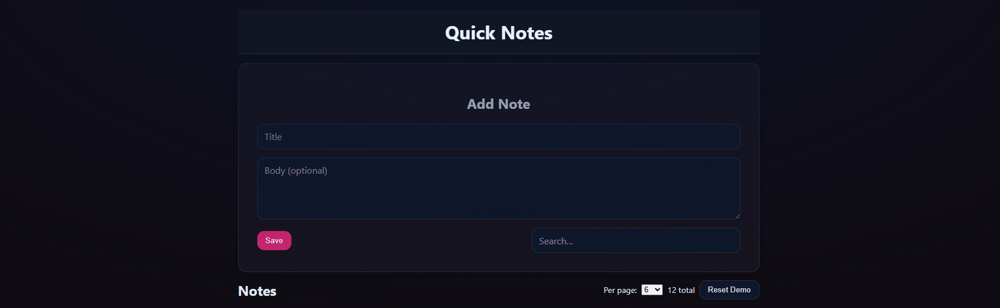
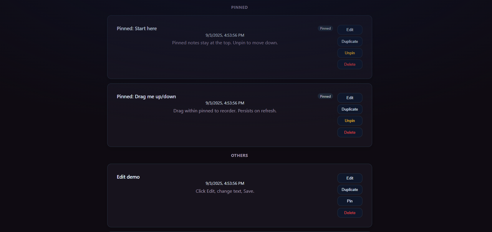

# Quick Notes 📝⚡  

_A lightweight MERN app for fast, organized note-taking with a polished, mobile-friendly UI._

---

## 🌟 Overview
**Quick Notes** is a full-stack MERN application that demonstrates clean CRUD functionality while keeping the experience simple, modern, and responsive. Designed for speed and clarity, it allows users to create, manage, and organize notes effortlessly.

---

## ✨ Features
- 📝 **Full CRUD** — create, read, update, and delete notes  
- 📌 **Pin / Unpin** — keep important notes at the top  
- 🔀 **Drag & Drop Reordering** — organize pinned/unpinned notes, with order persistence  
- 🔍 **Search & Pagination** — fast, server-side filtering and page controls  
- ♻️ **Reset Demo** — restore showcase notes instantly  
- 📱 **Mobile-Friendly** — clean, responsive design for all screen sizes  
- 🚀 **Single Service Deploy** — frontend served directly from Express production build  

---

## 🖼️ Screenshots
- **Landing Page**  

- **Notes Section**

---

## 🛠️ Technologies
  
### Frontend
- React + Vite  
- React Router  
- CSS  
- HTML  

### Backend
- Node.js + Express (CommonJS)  
- MongoDB + Mongoose  

### Other
- Heroku (deployment)  
- Morgan, dotenv, Helmet, CORS  

---

### 🔮 Future Improvements
- 🏷️ Tags / categories for better note organization  
- 🎨 Custom themes (light/dark modes)  
- ⏰ Reminders / due dates  
- 📤 Export or share notes  

---

## Try Quick-Notes Here!

  

> 💡 Tip: Click **Reset Demo** to explore showcase notes, then try pinning, drag-reordering, searching, and paginating.